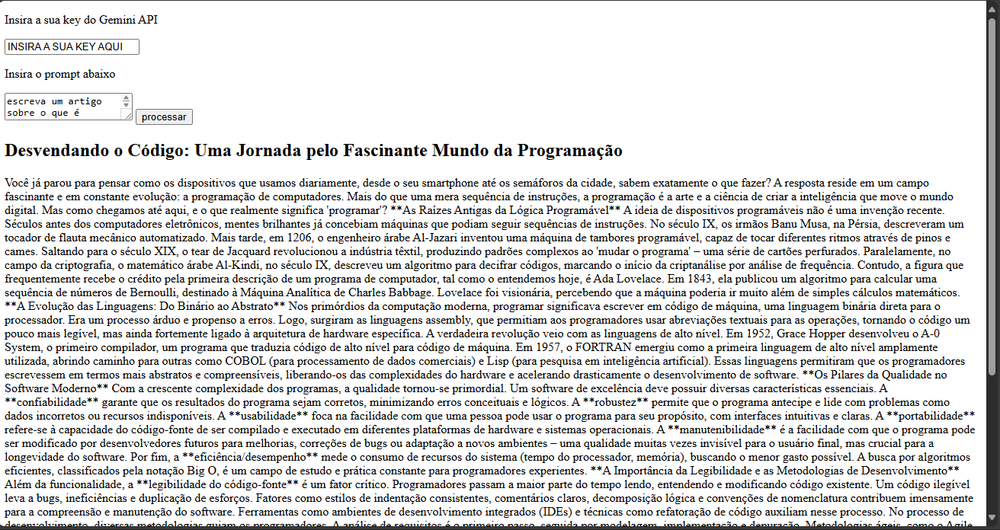
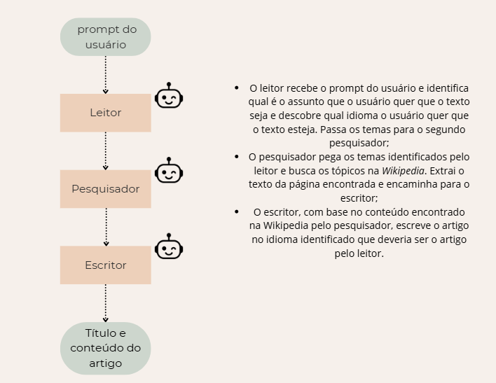

# Gerador de texto para o teste prático para a vaga de programador IA teste prático

## Sumário

- [Instalação](#instalação)
- [Exemplo de Uso](#exemplo-de-uso)
- [Detalhes Técnicos](#detalhes-técnicos)


## Instalação

Para instalar o repositório, execute no terminal

   ```bash
   git clone https://github.com/mickpires/gerador_de_texto_projeto_itec.git
   ```

Para instalar as dependências do código, recomendo utilizar `uv` que é um gerenciador de projetos. Ele pode ser facilmente instalado usando `pip`

```bash
    pip install uv
```

Após ter feito a instalação do `uv`, é somente necessário entrar no diretório do projeto e executar

```bash
uv run run.py
```

Ele irá baixar as dependências contidas no arquivo `pyproject.toml` e executar o código. É necessário então colocar na sua barra de navegação do navegador

```bash
localhost:5000
```

e será apresentado a API


## Exemplo de Uso

Para a API funcionar é necessário que o usuário forneça uma _key_ do Gemini API que pode ser facilmente criada. A seguir um link do site do google ensinando como que faz para criar uma _key_. Não é necessário inserir nenhum cartão de crédito para criar https://ai.google.dev/gemini-api/docs/quickstart?hl=pt-br.
Após feita a _key_ e inserida no espaço demarcado, o usuário pode escrever sobre o que o artigo deve ser. Abaixo está uma execução e de como que deve ser esperado o resultado. O artigo tem um titulo e o conteúdo.



## Detalhes técnicos

O _LLM_ utilizado para os agentes é o _gemini 2.5 flash_ porque, segundo o site do _Google AI_ sobre o _Gemini_, ele é o modelo apropriado para o uso em agentes e também apresenta uma boa quantidade de requisições disponíveis por dia, 250 requisições por dia na versão gratuíta.

A implementação dos agentes está em [`crew.py`](itec/crew.py). Lá tem somente uma função chamada `gerar_texto(prompt, key)` que recebe o _prompt_ do usuário e a sua _key_ do _gemini API_ e retorna o título e o conteúdo do texto gerado pelos agentes. Abaixo está um fluxograma do processo

