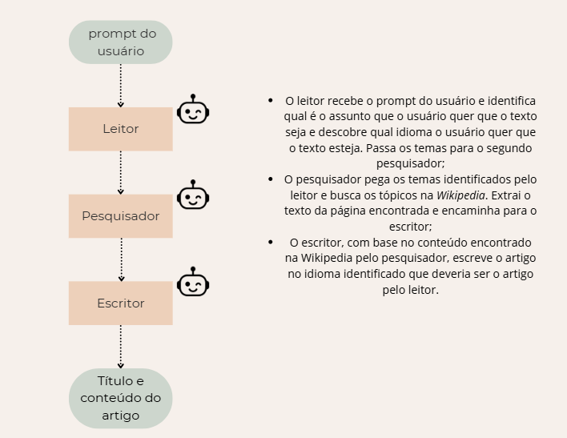

# Gerador de texto para o teste prático para a vaga de programador IA do ITEC

## Sumário

- [Instalação](#instalação)
- [Exemplo de Uso](#exemplo-de-uso)
- [Detalhes Técnicos](#detalhes-técnicos)
  - [A Escolha do LLM](#a-escolha-do-llm)
  - [Implementação dos Agentes](#implementação-dos-agentes)
  - [A API](#a-api)


## Instalação

Para instalar o repositório, execute no terminal

   ```bash
   git clone https://github.com/mickpires/gerador_de_texto_projeto_itec.git
   ```

Para instalar as dependências do código, recomendo utilizar `uv` que é um gerenciador de projetos. Ele pode ser facilmente instalado usando `pip`

```bash
    pip install uv
```

Após ter feito a instalação do `uv`, é somente necessário entrar no diretório do projeto e executar

```bash
uv run run.py
```

Ele irá baixar as dependências contidas no arquivo `pyproject.toml` e executar o código. É necessário então colocar na sua barra de navegação do navegador

```bash
localhost:5000
```

e será apresentado a API.
Abaixo uma imagem mostrando a tela inicial


## Exemplo de Uso

Para a API funcionar é necessário que o usuário forneça uma _key_ do Gemini API que pode ser facilmente criada. A seguir um link do site do _Google_ ensinando como que faz para criar uma _key_ (https://ai.google.dev/gemini-api/docs/quickstart?hl=pt-br). Não é necessário inserir nenhum cartão de crédito para criar.
Após feita a _key_ e inserida no espaço demarcado, o usuário pode escrever sobre o que o artigo deve ser. Abaixo está uma execução e de como que deve ser esperado o resultado. O artigo tem um titulo e o conteúdo.


## Detalhes Técnicos

### A Escolha do _LLM_

Nas primeiras implementações, o modelo utilizado era o _DeepSeek V3.1_ --- A versão gratuita ---, fornecido pela _OpenRouter_, porém houve vários problemas em utilizar este modelo. Dois deles foram: 
- O agente responsável de utilizar a tarefa de extrair --- o pesquisador ---, fazia a tarefa --- extraia o texto ---, mas não entendia que tinha que passar o texto extraído para o agente escritor. Então, ele gerava qualquer resposta e passava para o escritor. O escritor por sua vez, não conseguia atender ao que foi requerido pelo usuário e o processo era abortado; 
- Outro problema era que, por conta de ser pelo _OpenRouter_, o limite de execução da API deles por dia é de somente 50 por dia. O que limitou muito a capacidade de testar a implementação porque a parte importante é entender se os agentes estão entendendo o que está sendo pedido para eles.

O _LLM_ final utilizado para os agentes foi o _gemini 2.5 flash_ porque, segundo o site do _Google AI_ sobre o _Gemini_, ele é o modelo apropriado para o uso em agentes e também apresenta uma boa quantidade de requisições disponíveis por dia, 250 requisições por dia na versão gratuíta. Ele apresentou um resultado melhor do que o _DeepSeek V3.1_ para este tipo de tarefa, dificultando muito o processo de prototipagem.

### Implementação dos Agentes

A implementação dos agentes está em [`crew.py`](itec/crew.py). Lá tem somente uma função chamada `gerar_texto(prompt, key)` que recebe o _prompt_ do usuário e a sua _key_ do _gemini API_ e retorna o título e o conteúdo do texto gerado pelos agentes. Abaixo está um fluxograma desta função




A saida das _tasks_ do leitor e do escritor foram configuradas de uma forma que retornassem com os campos que estão definidos em [`pydantic.py`](itec/pydantic.py). Então, o leitor retorna uma lista com os tópicos detectados e _string_ indicando qual é o idioma que o escritor deve escrever o texto.
Como explicado pela figura, o pesquisador irá pegar estes tópicos e executar a ferramenta de buscar na _Wikipedia_ como implementada em [`tool.py`](itec/tool.py). Ela verifica se há uma página para o tópico identificado pelo leitor e se tem retorna o conteúdo dela. Ele vai fazer isto para todos os tópicos e depois vai colocar em uma lista e passar para o escritor. O escritor por fim, vai ter acesso a este texto extraído pelo pesquisador mais a linguagem detectada pelo leitor e vai escrever o texto, retornando o título e o conteúdo como especificado em [`tool.py`](itec/tool.py).

### A API

A API foi implementada utilizando _Flask_ por conta de sua facilidade na implementação de pequenos projetos. A API é somente em uma página simples em que o usuário deve fornecer um _prompt_ e uma _key_ para que ela execute o código. Foi optado esta escolha do usuário fornecer a _key_ por medidas de segurança --- não vazar a _key_ do autor.
A implementação pode ser vista em ['routes.py'](itec/'routes.py'). Quando o usuário aperta em executar o prompt e a key é passada para `gerar_texto` e no final retorna o título e o conteúdo do texto.
